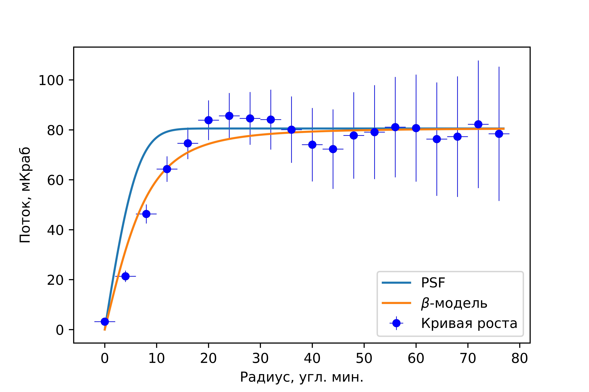
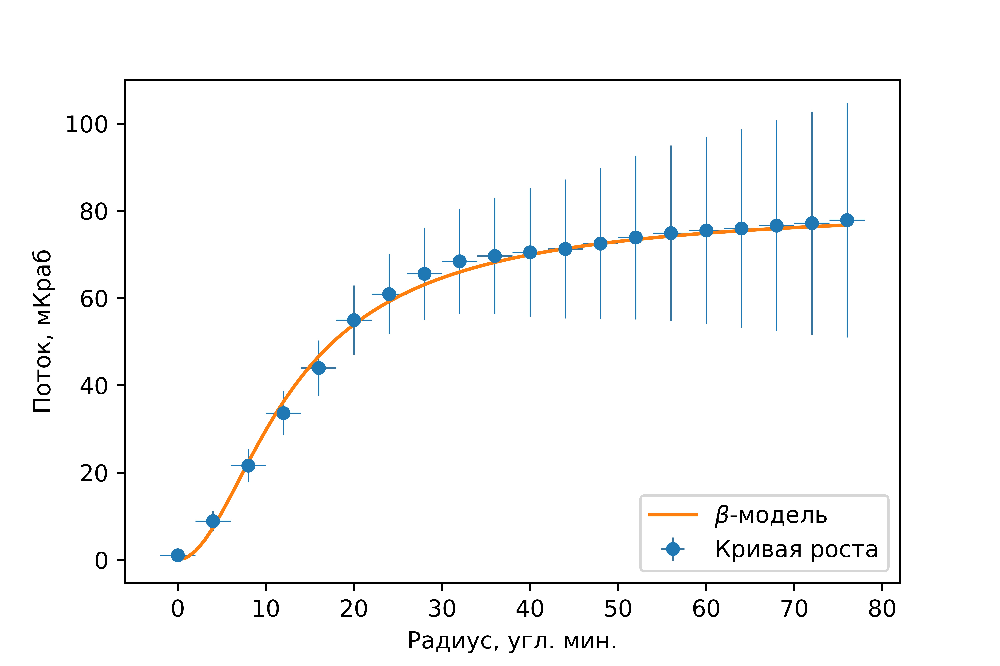
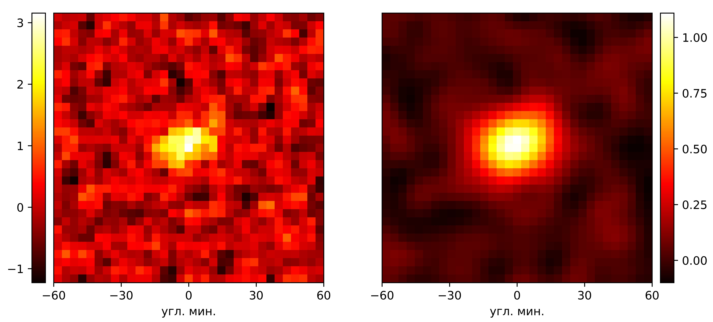
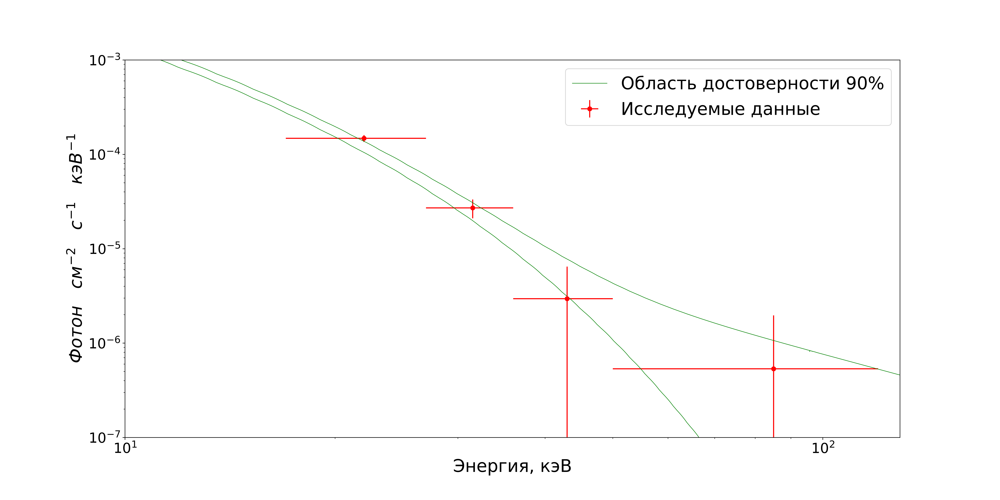
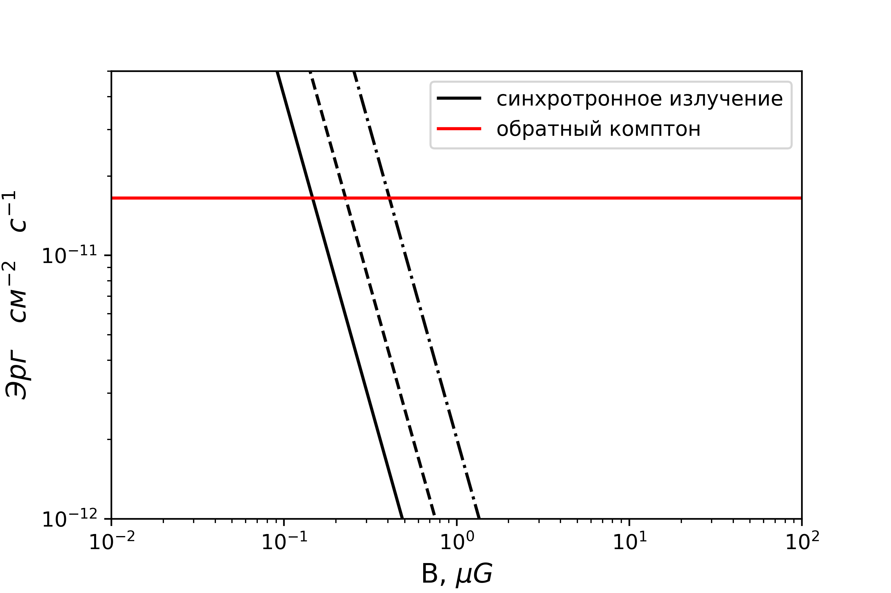

# Coma cluster Non-thermal emission

Materials for Bachelor of Science thesis

The paper presents the study of the Coma galaxy cluster's X-ray radiation on the data collected by the INTEGRAL observatory. 

Based on the spatial properties of the radiation flux, it was confirmed that the intracluster medium matter is distributed according to the isothermal 𝛽-model with 𝛽 = 0.741 and r𝑐 = 10.5′. 

<figure>
  <figtitle>Increase curve of original image</figtitle>
  
</figure>

<figure>
  <figtitle>Increase curve of filtered image</figtitle>
  
</figure>

<figure>
  <figtitle>Original and filetered images of the cluster</figtitle>
  
</figure>

The spectrum of the cluster in the 17-120 keV range was approximated (with high accuracy 𝜒2 = 0.16) by the model of thermal radiation of optically thin collision-ionized plasma (bremsstrahlung) with temperature T=8.2 keV in combination with a power-law with the photon index G = 2, corresponding to non-thermal radiation caused by Sunyaev–Zeldovich effect. 

<figure>
  <figtitle>90% confidence hard X-ray spectrum of Coma cluster</figtitle>
  
</figure>

The lack of measurement accuracy didn't allow us to detect non-thermal radiation, rather than to put an upper constraint on its flux. In the 20-80 keV range, the upper limit of the non-thermal radiation flux with an accuracy of one standard deviation was 1.1 × 10^-11 erg sm^-2 s^-1. From the upper limit of the non-thermal emission flux corresponding to 90% confidence (3σ), the lower limit of the magnetic field of the Coma galaxy cluster was computed. Assuming the field's homogeneity, the lower magnetic field limit was 𝐵_u ≥ 0.2 𝜇G. Considering the field’s heterogeneity, the determined magnetic field in the center of the cluster was 𝐵_c = 𝜑(𝑎) × 𝐵_u, where the factor 𝜑(𝑎) takes values from 1 to 2.8 depending on the assumed parameter of heterogeneity a.

<figure>
  <figtitle>Inverse compton flux and magnetic field from synchrotron radiation</figtitle>
  
   <figcaption>Solid line - homogeneous magnetic field. Dash, dash-dotted lines - limits for magnetic field in cluster's center for inhomogeneous field case</figcaption>
</figure>
